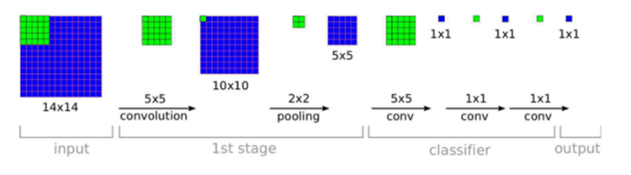
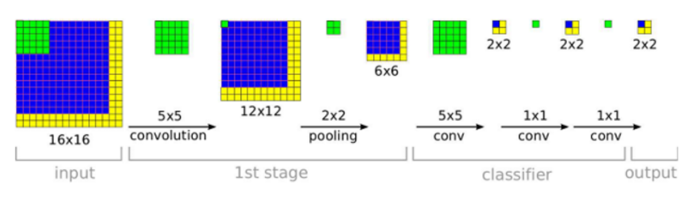
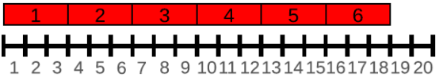
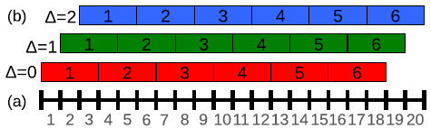
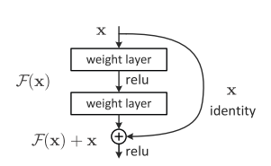
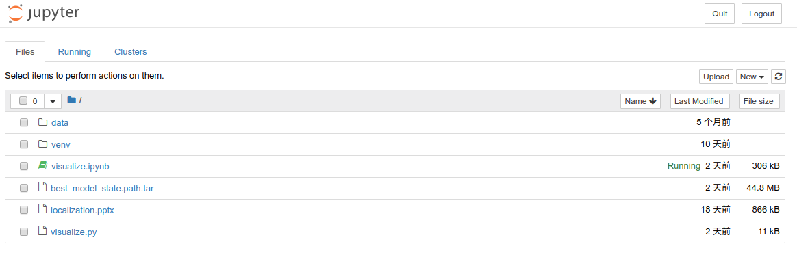
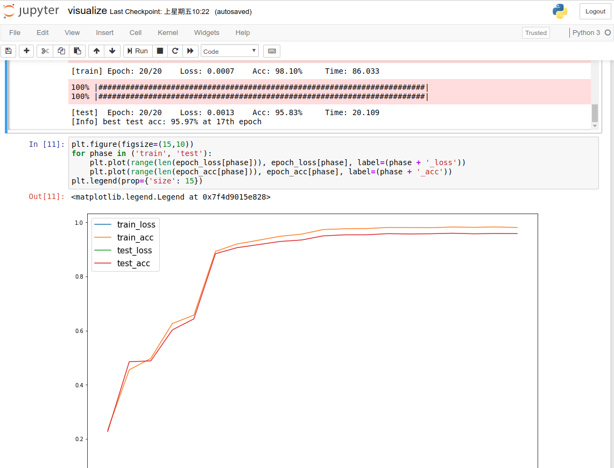
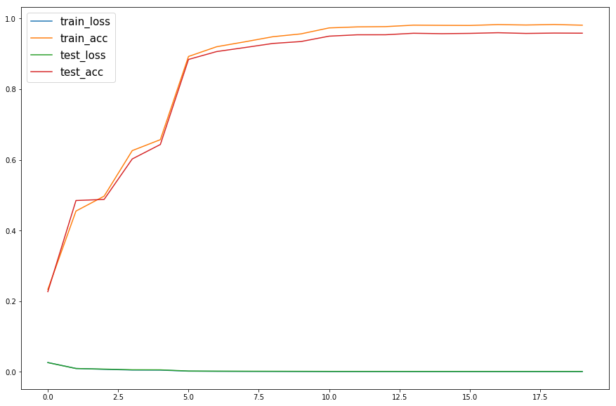
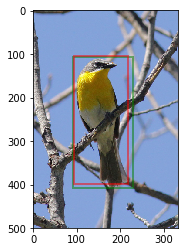

<center>

# CUB Localization

</center>

序号|学号|专业班级|姓名|性别
-|-|-|-|-
1|3150101155|计科1504|余锦成|男

## 1. Project Introduction
### 1.1. 开发环境
- 操作系统：Ubuntu18.04
- 开源框架：Python 3.6, jupyter 1.0.0, torch 0.5.0, torchvison 0.2.1
- 系统驱动：CUDA 9.0
- 硬件资源：GTX1050Ti
- 数据集：CUB

### 1.2. 项目要求
在CUB数据集上面对11788个样本、200种类别的鸟类训练一个神经网络，来定位图片上鸟的位置。
模型使用pytorch上提供的一个已经使用ImageNet进行训练的十八层深度残差网络，把最后一层的全连接层的输出改成4维，分别代表Bounding box的x, y, w, h。
按照类别对样本进行分层抽样，按8:2的比例划分为训练集和测试集。

## 2. Technical Details
### 2.1 相关模型
#### 2.1.1. Overfeat
Overfeat[^1]是2014年ICLR的经典图片分类、定位、物体检测的算法。该算法可以把图片的分类、定位、检查一起完成。该算法是对Alexnet算法进行改进，从而实现了更好的效果。
在Overfeat算法上，使用两个比较重要的算法：
- FCN (Fully Convolutional Network)[^2]
    FCN是对普通卷积神经网络的一个改进。
    在一般的卷积神经网络中，会在最后一层使用一个全连接层对feature map进行分类、定位或者检查。但是这样设置之后的网络模型，要求图片的输入是固定好的。比如Alexnet的网络输入就是227\*227的。因为最后一层的全连接层输入和输出都是固定的。
    而FCN的思想就是使用一张跟feature map大小一样的卷积核来代替卷积层到全连接层的链接。看成是对一整张图片的卷积运算。而把全连接层到全连接层的链接看成是1\*1的卷积核进行卷积运算。
    
    如上图，是一个简单的FCN模型。其设计时候使用14\*14作为输入，使用一个5\*5和2\*2的卷积核进行卷积运算，这跟一般的卷积神经网络是一样的结构。然后在得到一张5\*5的feature map的时候，没有使用全连接层，而是使用大小同样为5\*5的卷积核进行卷积，得到一张1\*1的feature map。这就用于替代一个1维输出的全连接层。后面再使用1*1的卷积核进行卷积，就相当一一个输入1维输出1维的全连接层。
    使用FCN的最大好处就是，由于没有全连接层，只有卷积层，所以它对输入大小并不敏感，输入大小可以任意。比如，上面的FCN网络如果输入16\*16的图片，如下图：
    
    一层层卷积出来之后，它的输出结果有2\*2=4个了。那么真正的结果是多少？对4个结果进行求平均就是了。实际上四个结果是对图片左上角、左下、右上、右下图片的14\*14区域进行判断的结果。求平均就相当于把四个子图的结果求平均而已。
- Offset max-pooling
    在一般卷积神经网络中，池化层如果遇到边界没有池化核大小大的时候会把边界的信息去掉。比如，在一维的情况下：
    
    一行共有20个像素，如果这时候池化核的宽是3的话，这时候19和20两个像素点会被丢掉。这时候可能会有信息丢失，对最后的预测结果可能也有差别。
    由于我们在使用FCN之后，输入的大小不固定，那么这种情况将在很多情况下会发生。怎么解决这个问题呢？这时候就可以使用Offset max-pooling算法：
    
    Offset max-pooling算法思想也是平均的思想，如上图所示，为了利用上19和20两个像素点，在pooling的时候，会忽略前面如干个点，这样就可以把后面的点给包含进来了。如果最后却两个点，那么就能产生三个pooling结果，分别是舍弃[19, 20]的，舍弃[1, 20]的和舍弃[1, 2]的结果。这样三个结果中间的结果一般也不一样的。三个结果分别送给下面的层，这样就能产生3个预测结果了，然后再对3个预测结果进行预测，就能够得到最终的结果了。这个结果把[19, 20]这两个像素点也考虑的进来。
    在二维的情况下，如果池化核大小为3，宽高上面都可能产生两列或两行像素的丢失的话，这时候能Offset max-pooling能产生9个结果。
    
基于这算法，Overfeat就能够对Alexnet进行改进了。
首先是训练的时候，跟Alexnet差不多，需要图片大小固定，这时候从训练数据的每张256\*256的图片上随机裁剪出221\*221的大小进行输入训练。训练方法采用随机梯度下降，对最后两个全连接层使用比重0.5的dropout。

对于测试，则跟Alexnet不一样了。Alexnet的测试是对于一张256\*256的图片进行裁剪：从四个角和中心裁剪五张224\*224的图片，然后把图片翻转一下，再裁剪五张，进行输入预测。但是这种裁剪可能会把物体的一部分给裁剪掉了。
对于Overfeat而言则是对图片进行缩放，得到六个尺度不一样的图片，然后分别输入训练好的网络中。由于使用了FCN和Offset max-pooling，网络对输入大小是没有约束的。然后把每个尺度的信息进行平均一下，得到一个最后的结果。
定位差不多，只是把最后的结果生成换一下，对于每个维度输出的bounding box进行融合，作为最后的结果。对于每个类别，都有一个bounding box的预测，然后根据预测的概率，加权平均融合作为最后结果。

#### 2.1.2. 深度残差网络
有一个定理Universal Approximation Theorem，说世界上的所有函数，都可以用一个足够复杂的模型拟合。所以，一个足够复杂的神经网络，配合一个足够多的训练数据，总可以解决问题。
提高神经网络的复杂性的一个途径就是提高神经网络的深度。深度越深，模型越复杂。但是实际上，网络深度越深，训练起来难度越大，因为简单增加深度，会产生梯度消失和梯度下降的问题。一个解决方法是使用正则化层。但是加入正则化层之后训练集的准确率趋于饱和甚至下降了，因为拟合上收到了限制。这个问题就是退化问题。

残差网络[^3]就是为了解决退化问题被提出来了。训练神经网络时候，我们不直接学习映射$H(x)$，而是学习其残差$F(x)=H(x)-x$，这样学习起来就更加简单了。
所以一层网络的结构可以表示为下图：

引入残差后，函数映射对输出的变化更敏，也就是说说其残差连接回传的梯度可以缓解梯度消失等问题。这也使得网络的层数可以很轻松地加深，使得模型也可以变得复杂，但是训练起来却不会太难。
### 2.2 算法实现

#### 2.2.1. 数据预处理
例程中大部分代码都是用来对数据进行预处理的。
1. 读取数据
    首先需要从文件中读取图片的路径信息和类别信息：
    ```python
    def split(ratio):
        with open('data/images.txt') as f:
            lines = f.read().splitlines()
        class_groups = dict()
        for line in lines:
            add line to class_groups
            
        test_id = []
        for _, group in class_groups.items():
            test_id.extend(randomsample(group, int(math.ceil(len(group)*ratio))))
        train_id = [i for i in map(str, range(1, len(lines)+1)) if i not in test_id]
    
        return train_id, test_id

    train_id, test_id = split(0.2)
    ```
    读取之后对，从中系统抽样出20%的测试数据。这里忽略掉了鸟的类别信息。
1. 构建数据集类
    在Pytorch中，可以构建一个数据集用于测试和训练：
    ```python
    class CUBDataset(Dataset):
        def __init__(self, im_ids, transform=Resize(224, 224)):
            with open('data/images.txt') as f:
                id_to_path = dict([l.split(' ', 1) for l in f.read().splitlines()])
            with open('data/bounding_boxes.txt') as f:
                id_to_box = dict()
                for line in f.read().splitlines():
                    im_id, *box = line.split(' ')
                    id_to_box[im_id] = list(map(float, box))
            self.imgs = [(os.path.join('data/images', id_to_path[i]), id_to_box[i])
                         for i in im_ids]
            self.transform = transform
                
        def __getitem__(self, index):
            path, box = self.imgs[index]
            im = Image.open(path).convert('RGB')
            im_size = np.array(im.size, dtype='float32')
            box = np.array(box, dtype='float32')
            
            im = self.transform(im)
            
            return im, box, im_size
        
        def __len__(self):
            return len(self.imgs)

    splits = {'train': train_id, 'test': test_id}
    datasets = {split: CUBDataset(splits[split]) for split in ('train', 'test')}
    ```
    该类设置接收一个id的列表，然后从这些图片id中读取图片路径和bouding box信息。然后定义重载[]运算符用于获取制定id的图片、bouding box和大小信息。默认会把图片大小调整为(224, 224)。
    然后根据刚才抽样的train_id和test_id构建出数据集。
1. 定义dataloader
    ```python
    dataloaders = {split: torch.utils.data.DataLoader(
                datasets[split], batch_size=32,shuffle=(split=='train'),
                num_workers=2, pin_memory=True) for split in ('train', 'test')}
    ```
    这个dataloader用于批量获取图片（一个batch有32个图片），用于后面训练。

#### 2.2.2. 模型训练
1. 修改模型
    ```python
    model = models.resnet18(pretrained=True)
    fc_in_size = model.fc.in_features
    model.fc = nn.Linear(fc_in_size, 4)
    model = model.cuda()
    criterion = nn.SmoothL1Loss().cuda()
    
    optimizer = torch.optim.Adam(model.parameters(), lr=1e-3)
    scheduler = lr_scheduler.StepLR(optimizer, step_size=5, gamma=0.1)
    ```
    首先是获取一个预训练号的18层残差网络，然后把最后一层全连接层输出改为4。最后定义一些优化器和计划器。

1. 训练模型
    ```python
    accs = AverageMeter()
    losses = AverageMeter()
    for phase in ('train', 'test'):
        if phase == 'train':
            scheduler.step()
            model.train(True)
        else:
            model.train(False)
            
        end = time.time()
        bar = progressbar.ProgressBar()
        for ims, boxes, im_sizes in bar(dataloaders[phase]):
            boxes = crop_boxes(boxes, im_sizes)
            boxes = box_transform(boxes, im_sizes)
            
            inputs = Variable(ims.cuda())
            targets = Variable(boxes.cuda())
            
            optimizer.zero_grad()
            
            # forward
            outputs = model(inputs)
            loss = criterion(outputs, targets)
            acc = compute_acc(outputs.data.cpu(), targets.data.cpu(), im_sizes)
            
            nsample = inputs.size(0)
            accs.update(acc, nsample)
            losses.update(loss.data[0], nsample)
            
            if phase == 'train':
                loss.backward()
                optimizer.step()
    ```
    训练过程比较简单，获取一个batch的数据，输入到模型中，根据输出得到误差，然后反向传播误差。
    节选代码中没有涉及的是多个epoch训练，选出所有epoch中最好测试的结果作为最后结果，防止overfitting。

### 2.3 模型的可能改进
这次实验的结果其实已经很好了，测试准确率达到了96%。但是我个人认为模型还存在可以改进的地方。
模型最后是直接改变最后一层全连接层的输出变为4维，并且抛弃了原有的类别信息。鸟的类别和鸟的定位其实并非完全独立，并且存在一定关系的。所以模型可以利用类型信息进行训练以达到更高的准确度。
本人对Pytorch不是很了解，所以只能提出一个理论模型：
最后一层全连接层，就如同Overfeat模型一样的思路，改为5*200维的输出。其中200为鸟的种类数，5分为两部分，其中1维是属于该类别的信息，而剩下4维则是bounding box信息。最后的bounding box根据其概率加权平均融合bounding box作为最后的结果。
另外还可以参考Alexnet的思想，把图片输入进行子图采样输入，生成10张子图，输入网络中，再平均最后结果，得到一个更加准确的结果。

## 3.Experiment Results
### 3.1. 系统界面
本次实验打开运行在jupyter上，打开浏览器就可以看到运行界面了：

打开其中的`visualize.ipynb`，就打开了我们的源代码了。界面如下：

顶栏有各种编辑功能，如保存，复制粘贴等。还有代码相关的功能，比如运行、停止和重新开始等。
点击第一个代码块，选择运行，就可以运行第一个代码块了。一个一个运行下来直到运行到最后一个代码块即可。
### 3.2. 操作说明
为了在jupyter上运行代码，我们首先需要配置一个虚拟环境：
```shell
virtualenv -p /usr/bin/python3 venv
```
这样就在venv目录下面有一个虚拟目录了，里面使用的是python3。
然后在shell中激活该虚拟环境
```shell
source venv/bin/activate
```
激活成功之后就可以安装依赖包了：
```shell
pip3 install jupyter torch torchvision matplotlib progressbar pillow
```
等待安装完成之后，就可以运行jupyter了：
```shell
jupyter notebook
```
接着访问其中带token的链接即可大概上面说道的页面了。
### 3.3. 运行结果
最后模型训练出来之后，可以看到每个epoch的准确度信息：

其中第17次训练的测试精度最高：
```
[Info] best test acc: 95.97% at 17th epoch
```
最后随机选择了一张图片进行测试，效果也是非常好的：


## References
[^1]: OverFeat: Integrated Recognition, Localization and Detection using Convolutional Networks
[^2]: Fully Convolutional Networks for Semantic Segmentation
[^3]: Deep Residual Learning for Image Recognition