<center>

# Image Recover

</center>

序号|学号|专业班级|姓名|性别
-|-|-|-|-
1|3150101155|计科1504|余锦成|男


## 1. Project Introduction
### 1.1. 开发环境
- 操作系统：Ubuntu18.04
- 开源框架：Python 3.6, scikit-learn 0.19.1, opencv-python 3.4.0.14, numpy 1.14.3
- IDE：PyCharm
- 项目管理工具：git

### 1.2. 项目要求
提供三张经过毁坏的图片，这三张图片的三个通道分别以一定的比例等概率地随机把某个像素点值设置为0。我们的任务是把这个图片尽量修复。最后评估指标是使用原图与修复图像每个像素的第二范式和（欧氏距离）。
三张待修复的图片如下所示：
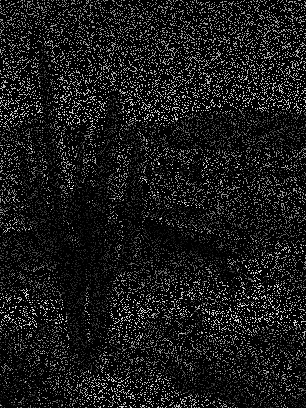
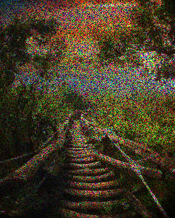
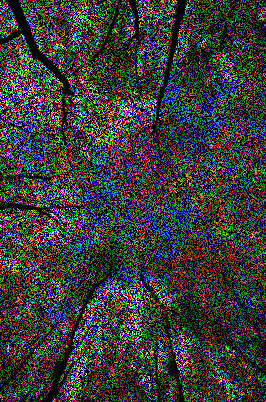

## 2. Technical Details
### 2. 理论阐述
#### 2.1.1. Baseline

该算法对每一行进行单独地恢复。对一行像素而言，对其横坐标$x$进行归一化，然后套入一个基函数$\phi$，进行一个非线性映射$\phi(x)$，对于映射后的坐标以及其未损坏的像素值$t$进行最大似然估计线性拟合$\mathbf{w}^T\mathbf{\phi(x)}$。
修复的时候使用的基函数为
$$
\phi(x)=\exp{\left[-\frac{(x-\mu)^2}{2s^2}\right]}
$$
是不经过归一化的高斯分布密度函数。其中的均值是对于基函数个数的从0-1的线性插值。

在实际使用中，我们使用的基函数是50个，对应的方差为0.01。此处0.01近似宽度像素点个数除以基函数个数乘以三，也就是说，一个像素点的附近的三个点对该点的影响最大。

这种算法的坏处是只对于某一行某一个通道进行计算，计算的时候缺少了上一行和下一行的联系以及两个通道之间的联系，并且计算一个点的时候使用了一整行的信息，这也显得太过不合适。

修复的效果如下图所示：
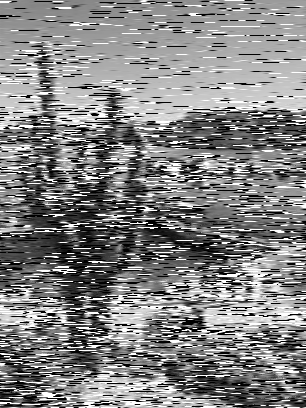

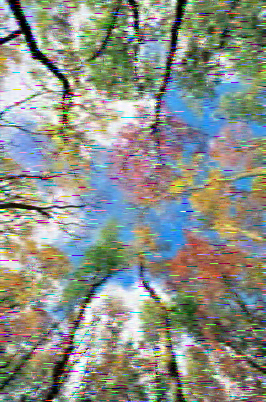

可以看到修复效果并不是很好，主要是一行上有很多长条的噪点，上下行之间可以看到明显差别，不同通道之间统一性较差。在遇到临近三个点都被污染的时候，容易出现预测错误而出现长条噪点。

#### 2.1.2. BaseBlock

为了解决Baseline算法对于行与行之间的联系不密切的问题，我对上一个算法尝试了一些改进。首先我使用了二维的坐标信息$x=[x_1, x_2]$，基函数使用的是二元高斯分布密度函数：
$$
\phi(x)=\exp{\left[-\frac{(x-\mu)^T\Sigma^{-1}(x-\mu)}{2}\right]}
$$
其中均值第一维和第二维都是0-1的线性插值。所以最后基函数的格式是一维插值数量的平方。
实际调参时候，插值了15个数，所以基函数为$15^2+1$个，最后一个是Bias。
方差使用$0.01\mathbf{I}$，其中的0.01也以为着横坐标附近三个点（纵坐标由于原图不是方形，所以大概为5-6个像素点）。
最后的效果如下图所示：


可以看出，最后效果比Baseline稍微好一点，没有长条的噪点了，但是椒盐噪点还是有不少，而且图片细节丢失比较严重，所以这个模型并不是很好。

#### 2.1.3. 均值滤波

均值滤波算法并不是一个学习模型，但是是修复图片噪点的一个算法。我在研究过程中进行了测试。
这个算法思想很简单，一个点的值使用以它为中心的九宫格的周围八个点的像素的均值。简单使用这个算法之后可以得出的结果如下图所示：
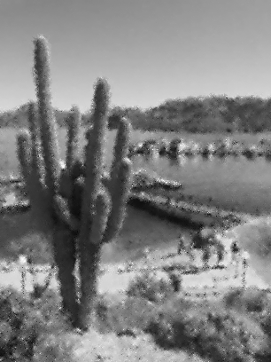

可以看到，在噪点比例比较少的时候，恢复效果很好，但是在噪点比例较多的时候，九宫格只有一个有效点或者没有有效点较大的宫格进行计算时候，效果就会变得比较差了。

#### 2.1.4. Gradient Boosting

Boosting算法是使用多个弱分类器进行结合在一起分类的分类器。使用这种分类器我们可以实现一个回归算法。弱分类器之间的组合和权重使用梯度提升减小误差就是Gradient Boosting的思想。
在实践中，我使用了第二范式和进行误差估计。
具体效果如下：


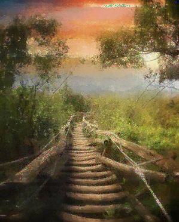

可以看到效果其实不是很好，尤其在噪点比例比较大的时候。而且因为是用多分类器进行回归，可以明显看到有一个一个的小格，这个是最明显的不足点。而且噪点也比较多，效果不是很好。

#### 2.1.5 Random Forest
随机森林算法是一种比较灵活的机器学习算法。在二分类问题中，我们可以学习一颗决策树对样本进行分类。但是这样一颗决策树是比较弱的分类器。那么随机森林就是通过有放回地随机抽取不同的样本进行决策树的学习，最后生成多颗决策树，汇总它们的决策结果作为随机森林的答案。随机森林的思想类似与Boosting，不过它的各个分类器都是一颗决策树。

直接10颗决策树的随机森林的算法如下图所示：
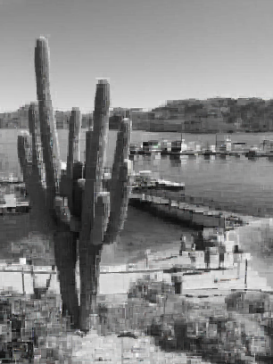

可以看到效果不错，对比均值滤波而言效果都要好一点。但是存在着跟Boosting一样的问题，就是出现小方格一样的图片分块不连续的效果。提高决策树的数量也没什么改善。

### 2.2 算法实现
#### 2.2.1. 数据预处理
虽然我测试了好几个算法的效果，但其实实现都比较类似的。主要是提取出其中的训练数据特征、值以及测试数据特征。
具体内容如下：
- 首先读取图片，然后进行转置，获得图片为三维矩阵通道、宽、高。这里我还做了归一化处理。
    ```python
    corr_img = corr_img.transpose() / 255
    ```
- 提取Mask。这里对每个通道而言，把所有为0的像素点都认为是Nosie。
    ```python
    noise_mask = corr_img == 0
    ```
- 提取特征。这里的特征主要是像素的坐标和通道信息：
    ```python
    (train_channel_index, train_x_index, train_y_index) = \
                                np.nonzero(~noise_mask)
    (predict_channel_index, predict_x_index, predict_y_index) = \
                                np.nonzero(~noise_mask)
    ```
- 提取训练值。直接代入坐标即可：
    ```python
    train_value = corr_img[train_channel_index, train_x_index, train_y_index]
    ```
- 在使用Baseblock时候，还需要把测试数据展成一个测试数据数\*基函数数\*特征数的一个矩阵。
    ```python
    train_coordinates = np.concatenate([[train_x], [train_y]]).transpose()
    train_coordinates = np.array([train_coordinates] * basis_num ** 2).swapaxes(0, 1)
    ```

#### 2.2.2. 算法实现
感觉sklearn库，有很多模型已经有实现了。我们Random Forest和Gradient Boosting可以直接使用这个库进行调参。
```python
g = sklearn.Model()
g.fit(X,y)
y_head = g.Predict(X_head)
```

但是Baseline和Baseblock和均值滤波需要自己实现。
- Baseline
    Baseline需要算出一个$\Phi$矩阵用于计算。
    先构造出一个第一列为1的矩阵：
    ```python
    train_phi = np.column_stack((np.ones([train_num, 1]), \
                np.zeros([train_num, basis_num - 1])))
    ```
    然后剩下的列用来求基函数的结果：
    ```python
    train_phi[:, 1: basis_num] = norm.pdf((np.array([train_x] * \
                                         (basis_num-1)).T - mu) \
                                / sigma) * np.sqrt(2 * np.pi)
    ```
    最后按照公式求出w:
    ```python
    w = (train_phi.T * train_phi).I * train_phi.T * corr_img[c, train_index, h].T
    ```
    然后对测试集进行同样的求值，然后进行预测：
    ```python
    recover_img[c, predict_index, h] = w.transpose() * predict_phi.transpose()
    ```
- Baseblock
    Baseblock的实现稍微复杂一点。但是跟Baseline差不多。在把$X$展开成试数据数\*基函数数\*特征数的一个矩阵之后，对生成的$\mu$相减之后同一代入二元高斯中计算，可以节省大量运算时间：
    ```python
    train_coordinates = train_coordinates - mu
    train_coordinates = train_coordinates.reshape(train_num * basis_num ** 2, 2)
    ```
    然后构造初始矩阵和完善矩阵：
    ```python
    train_phi = np.column_stack((np.ones([train_num, 1]), \
                     np.zeros([train_num, basis_num**2])))
    train_phi[:, 1:basis_num**2 + 1] = \ 
        multivariate_normal.pdf(train_coordinates, cov=sigma)\
        .reshape(train_num, basis_num**2)
    ```
- 均值滤波
    均值滤波实现比较简单，只要对于每个九宫格进行迭代计算就可以。不过注意block内可能没有一个可行点，这时候需要扩大宫格的大小。伪代码如下：
    ```python
    def mean(block_size):
        for block in generate_block(block_size)
            if block is valid and center is corrupted:
                block[center] = np.mean(block[other])
            else:
                mean(block_size + 1)
    ```

## 3.Experiment Results
### 3.1. 系统界面
本项目没有主界面，在项目中有多个.py文件，在安装依赖之后运行就可以了。
### 3.2. 操作说明
首先需要安装依赖：
```bash
pip3 install -r requirements.txt
```
然后运行想要运行的模型，第一个参数为图片路劲：
```bash
python3 random_forest.py ./img/A.png
```
修复完成之后，会显示图片的对比，并且把修复后图片保存在图片目录下，文件名为：图片名_模型.png
### 3.3. 运行结果
运行之后，我们可以看到所选模型的修复前后结果对比：
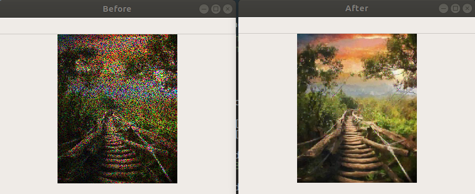
### 3.4. 总结
这次实验非常有趣，对于图像进行修复是人工智能的一大重要的应用。人工智能能够把一张人类都已经看不清的图片修复成人类可以辨识的图片，非常厉害。而且这种工作不是普通人能够完成的。
在过程中，一开始我对原有的Baseline算法进行二维扩展之后效果并不是很好，这一点我是比较失望的。
后来我想用一个GMM模型对图片的一个小区域进行拟合，然后算出待修复点的数学期望进行修复，但无奈把GMM用于回归上是比较难以实现的。我在网上对于GMM模型对于图片的修复方面的文献进行搜索，发现其效果还是很棒的[^1]，但是自己没有足够的时间进行复现。其效果如下：
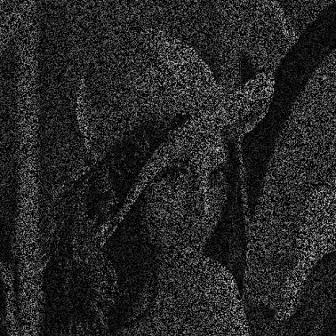
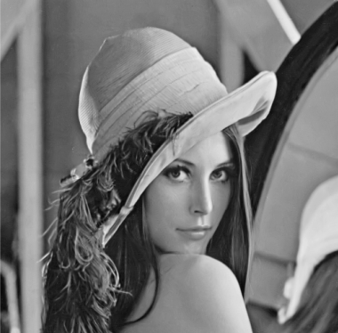
可以看到细节处理和光滑程度都很棒。该算法在进行图像插值时候，认为两个patch之间是存在一定迭代关系的。并且使用GMM去拟合一个patch的分布。在GMM拟合之前使用kNN算法进行聚类。

最后尝试了Boosting和Random Forest这两个机器学习中比价著名的回归算法，发现效果都可以。尤其是Random Forest，是唯一一个比均值滤波效果还好的算法。而且Random Forest的思想比较简单，实现起来速度也比较快，并且效果很好，而且很通用，也是我个人比较喜欢的一个算法。

## References
[^1]: Image Restoration Using Gaussian Mixture Models With Spatially Constrained Patch Clustering