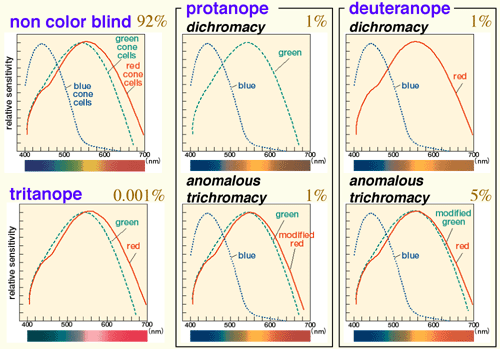

# AS#5: Glasses for the color deficient
1. 
    - the spectral responses without glasses:
    $$
    x=1
    $$

2. Potential problem
    - It filter some color of the light so the brightness will be lower. So the glasses are not fit for the situation that light is weak.
    - Only work for protanope anomalous trichromacy and deuteranope anomalous trichromacy. Not working for tritanope and protanope dichromacy and deueranope dichromacy.

        
    
        picture references from http://jfly.iam.u-tokyo.ac.jp/color/