# 图形学第七次作业——Draw Your Dream Car
|余锦成|3150101155|
|:-:|:-:|

## 实验要求

1. 使用3D建模软件画出一两自己梦想中的车。
1. 写一份报告说明如何构建这个模型。
1. 为不同的部件选择不同的建模技术，并对比其他技术。

## 实验原理

1. 多边形建模技术
多边形建模是通过使用复杂多边形对对象进行尽量拟合。多边形拟合对比`NURBS`没有很高的精度，但是调整多边形对象相对更加自由。
1. `NURBS`建模技术
`NURBS`是Non-Uniform Rational B-Spline（非同一有理B样条曲线）的缩写。1991年，国际标准化组织（ISO）颁布的工业产品数据交换标准STEP中，把NURBS作为定义工业产品几何形状的唯一数学方法。`NURBS`使用数学函数来描述曲线和曲面，并通过参数来控制进度，这种方法可以让`NURBS`对象打倒任何想要的精度。[^NURBS]

## 实验步骤

1. 首先需要在系统上安装MAYA。我安装了2016版本，并使用了学生授权版本。
1. 寻找参考的汽车三视图蓝图。
这里我使用了这张图[^blueprint]。这张图的实体车是`Lamborghini Murciélago`[^car]。
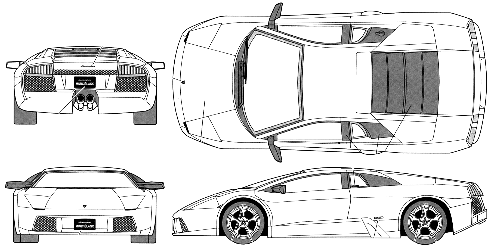
1. 打开MAYA之后，选择四视图模式，在每个视图上，导入相关裁剪过后的视图图片（选择`View`->`Image Plane`->`Import Image`）。
这是导入之后的效果。
当然这个参考图是仅作参考。因为不保证这个三视图是完全准确的。
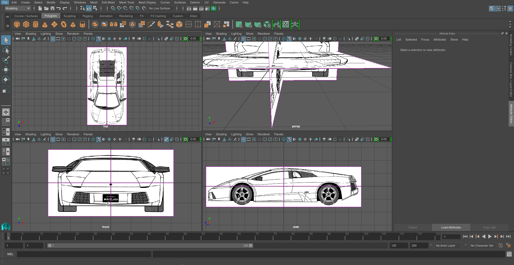
1. 新建一个圆环，并且裁省一个表面，用于作为车轮外框。对比三个不同视图，调整位置和控制点位置。然后删去无用边。
得出效果如下。
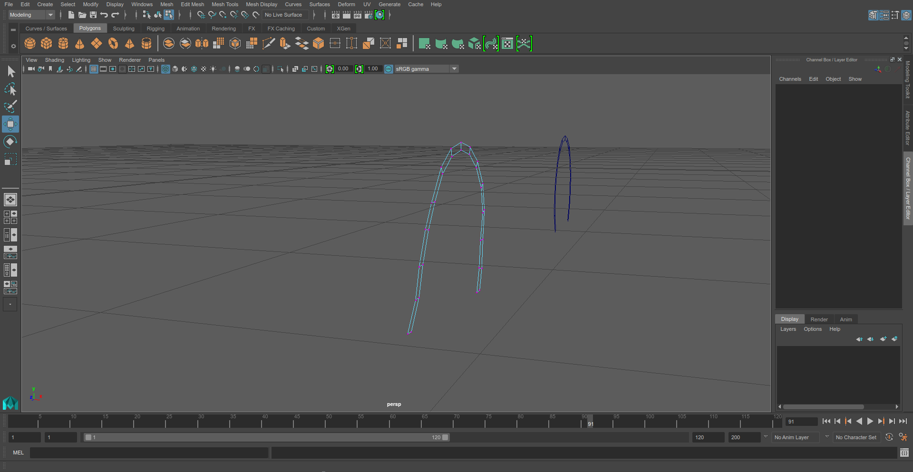
1. 在这个圆环基础上，选择边进行挤出`Extrude`。对照三视图调整新挤出边的断点的位置。重复这个步骤，可以不断地对模型关键点进行绘制。
以下是对车头部分进行绘制的结果。
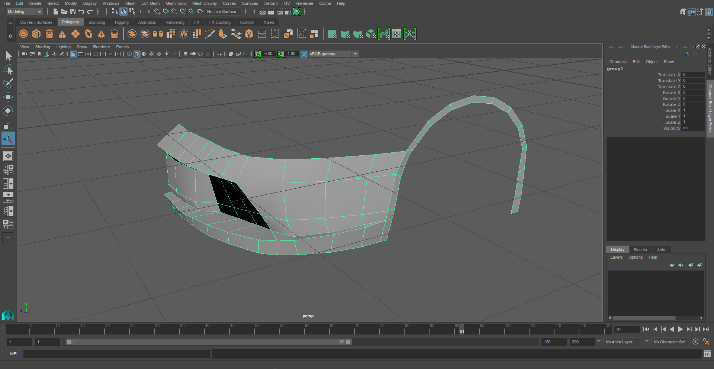
对车侧部进行绘制。对于后续添加的点，如果要跟原来的点连接起来，可以选择这两个点之后使用`merge`工具来合并。
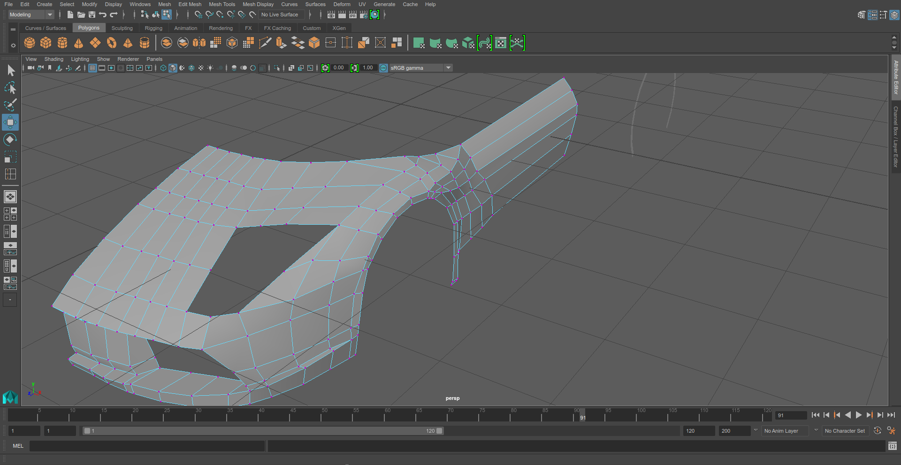
增加对车顶和车窗的绘制
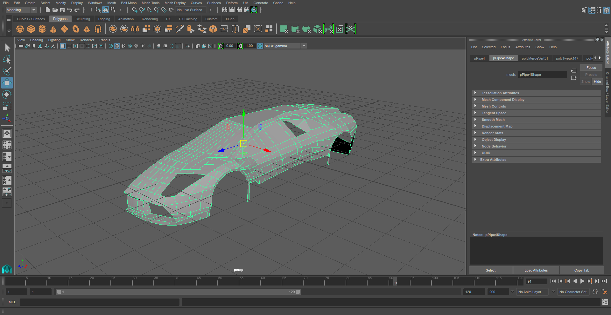
然后对车的尾部进行绘制
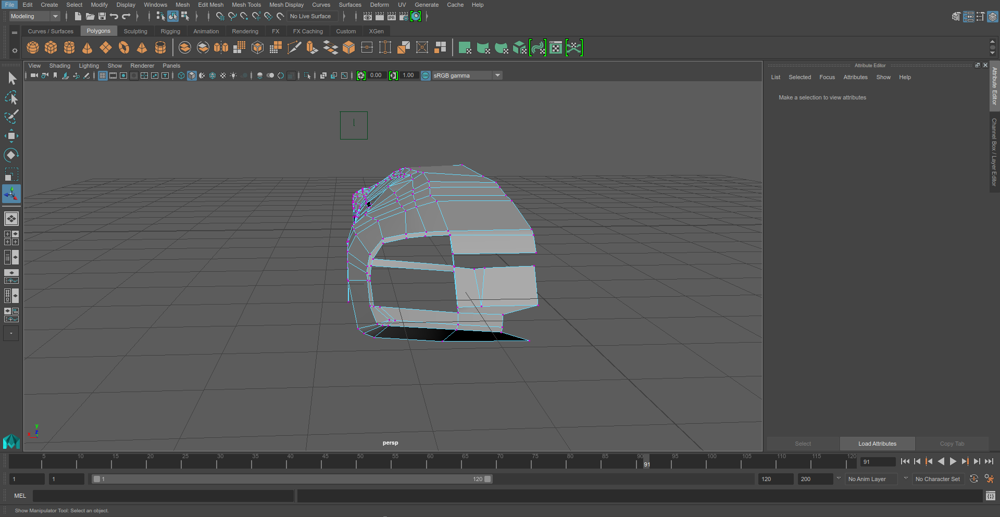
这是最后的总体效果。使用了`smooth`工具进行了一定的圆滑。
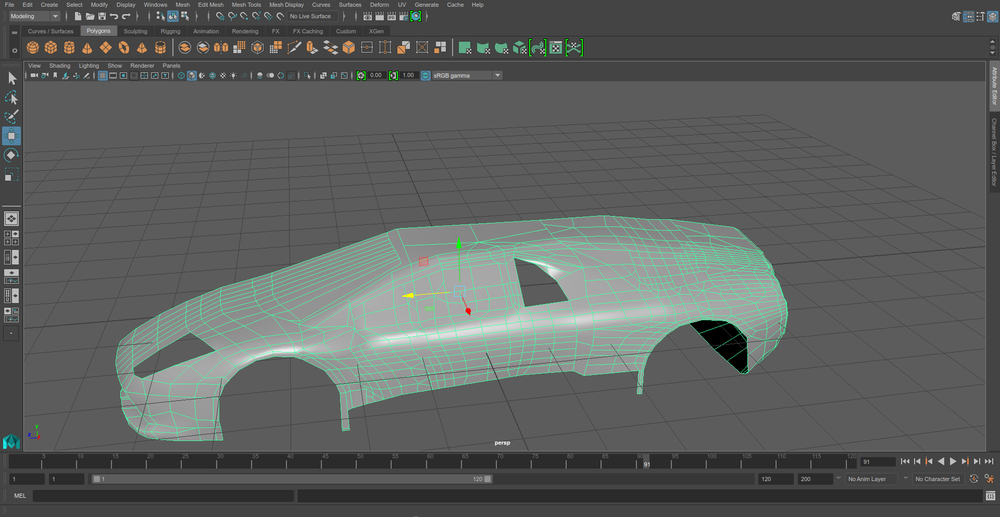
1. 可以对车的材质进行设置。打开`window`->`renderer editor`->`hyper shade`进行材质。
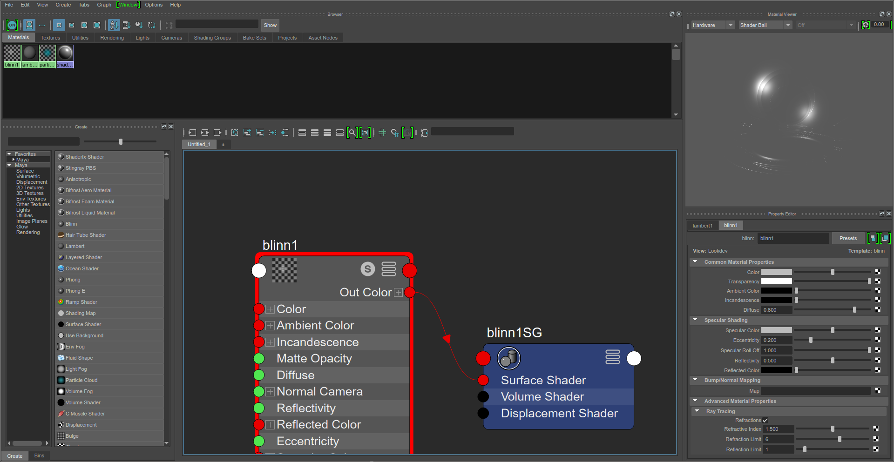
然后可以给车的不同的面进行上色。

或者给玻璃添加透明材质。通过设置透明和反射率来设置玻璃材质。
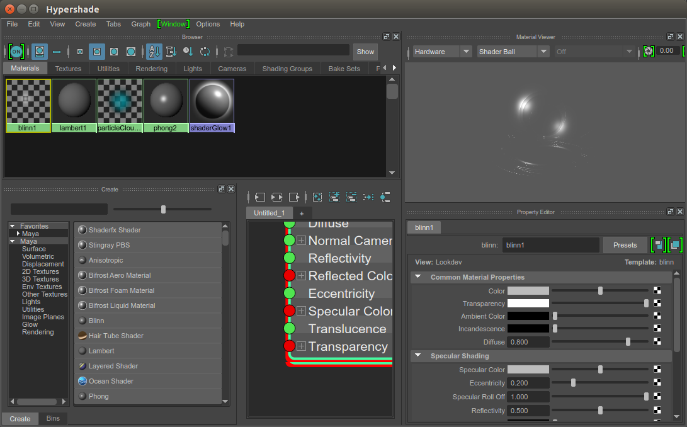
1. 添加底盘，增加转向灯等材质。然后就可以把现有模型进行复制，对称操作，一辆车就基本完成了。
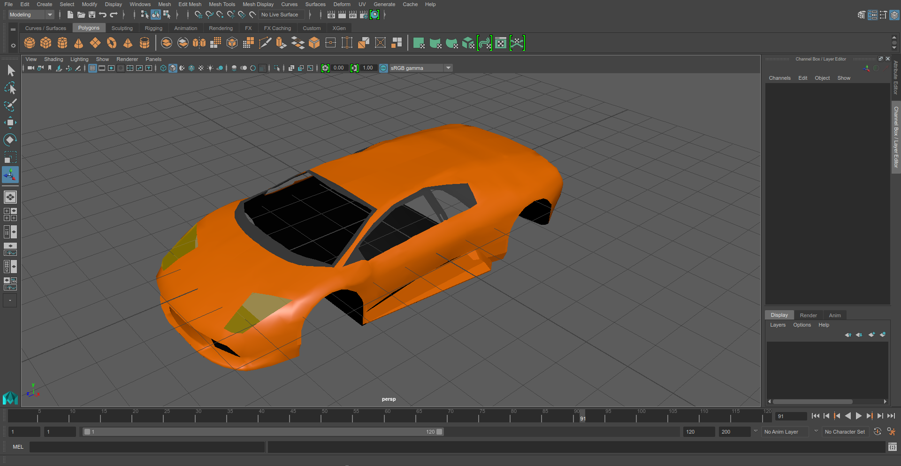
1. 使用`NURBS`技术画出轮子。车子就完工了
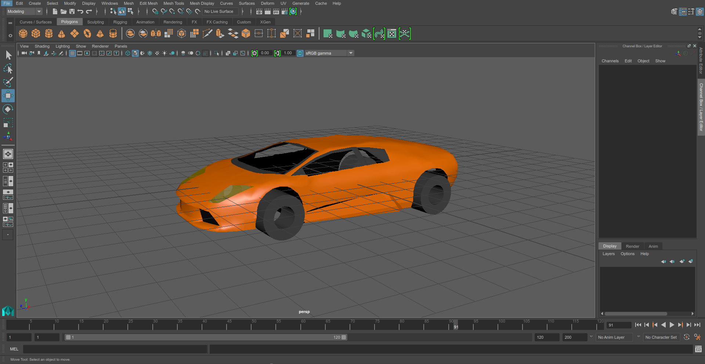
因为轮子是旋转体，使用`NURBS`进行绘制比较简单而且精确。而使用多边形对圆柱进行拟合总是不尽人意的。
（很抱歉最后画好轮子之后还没来得急保存和截图工程就崩溃了，最后使用了简单的圆柱工具）

## 心得与讨论

这次实验并不简单，花费了我相当对的时间。主要是因为对软件操作的不熟悉，不掌握快捷键以及更好的实践方式。所以最后做出来的效果比较粗糙。
虽然模型做了出来。但是保存文件重新打开后会出现某些特定面材质丢失的情况。重新添加了好几次材质也没有解决这个问题，应该是某些面的材质设置的方式出了问题，也没能找到问题所在。
## 参考
[^NURBS]: https://en.wikipedia.org/wiki/Non-uniform_rational_B-spline
[^blueprint]: http://drawingdatabase.com/wp-content/uploads/2015/01/lamborghini-murcielago-03.gif
[^car]: https://en.wikipedia.org/wiki/Lamborghini_Murci%C3%A9lago