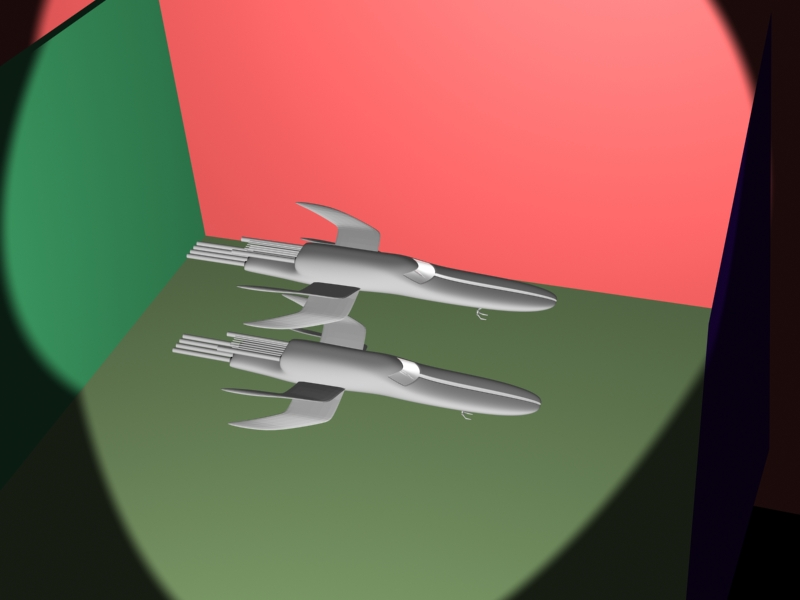

# Ray Tracing
## 效果图

作为对比，这里给出没有使用ray tracing的效果图

可以看出来，使用ray tracing之后，飞机机体上可以看到另一架飞机的倒影，而且有墙上反射回来的光，还可以看到反射回来的光在机体上产生的阴影。

## 步骤
1. 打开3D Max，把我们的模型导如进去。
1. 复制一次我们的模型，方便观察效果。
1. 创建强，也是方便
1. 打开3D Max的材质编辑器，创建一个ray tracing的贴图
1. 选中飞机，把创建的ray tracing贴图付给飞机。
1. 检查渲染器是否已经打开ray tracing。
1. 渲染出图片。