# Assignment #4
## 1. Spectral Clustering
- a 
    The result of my clustering is shown as follow:
    - kmeans:
        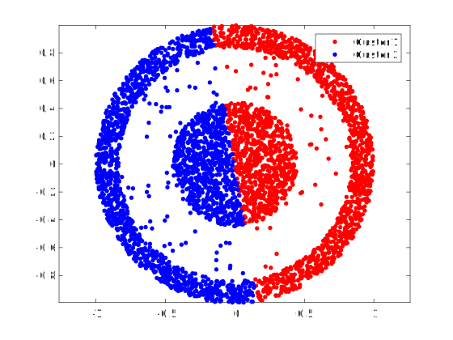
    - Spectral Clustering:
        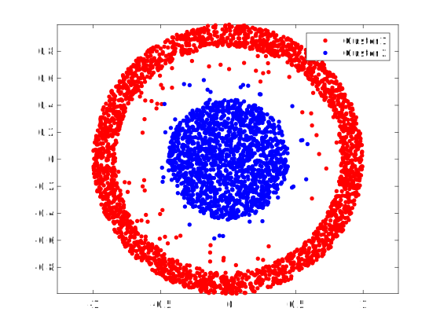
        I use 200 neighbors and 0.5 threshold in the Spectral Clustering.
- b
    I run both kmeans and spectral clustering for 50 times.
    And as a result, the accuracy of the kmeans is 50.153%, and the the normalized mutual information metric is 0.38384.
    The accuracy of Spectral Clustering is 71.759% and the normalized mutual information metric is 0.27937.

 
## 2. Principal Component Analysis
- a
    The result after using PCA to recover the non-rotated CAPTCHA image:
    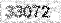
    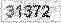
    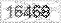
    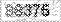
    
- b
    - i.
        The Eigenface are shown as follow:
        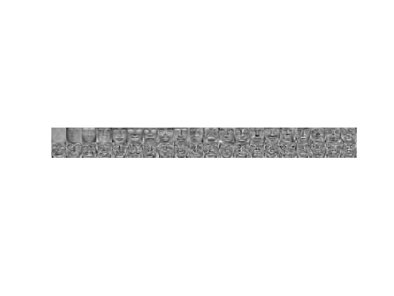
    - ii.
        I use 1-nn in this experiment. And the testing error rate of each number of reduced dimensionality are as follows:
        - 8
            75.5%
        - 16
            80.0%
        - 32
            82.0%
        - 64
            85.0%
        - 128
            85.0%

    - iii.
        Yes. It case a certain extent loss of information. But the loss is regardless because it doesn't have huge performance effect.
        The testing error rate of each number of reduced dimensionality are as follows:
        - 8
            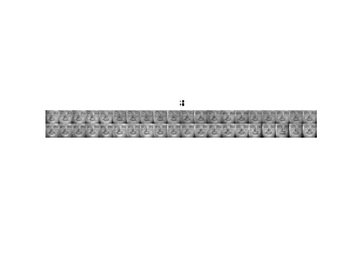
        - 16
            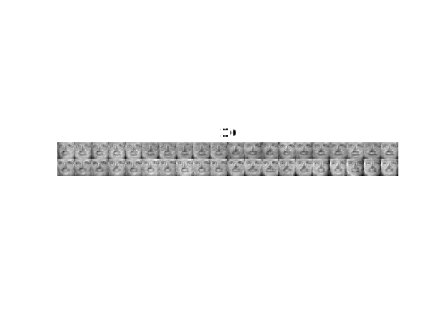
        - 32
            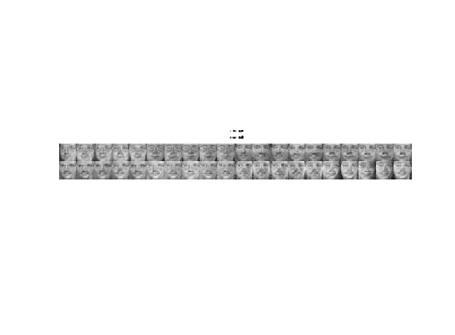
        - 64
            
        - 128
            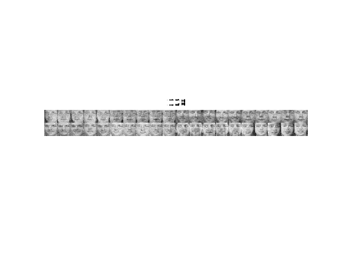
- c
    I tried to use LDA for classification after dimension reduction. The dimension I use is the number of class minus 1. In this dataset, it's 39.
    The accuracy is 94% with 1-nn. It's much better than using PCA (85%) and raw data (also 85%).