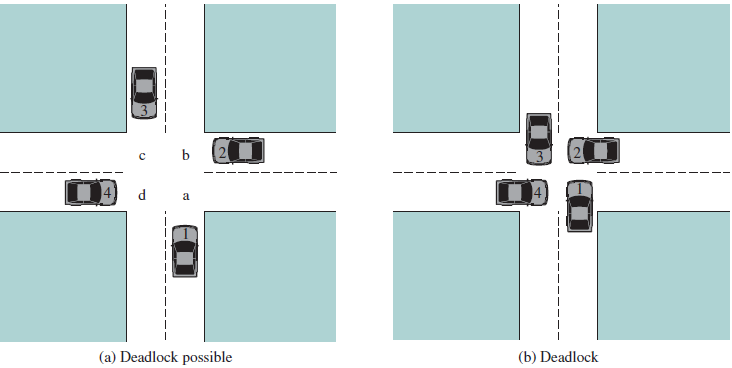

# 操作系统实验一 同步互斥和Linux内核模块

|余锦成|3150101155|
|:-:|:-:|


## 实验目的

- 学习使用Linux的系统调用和`pthread`线程库编写程序。
- 充分理解对共享变量的访问需要原子操作。
- 进一步理解、掌握操作系统进程和线程概念，进程或线程的同步与互斥。
- 学习编写多线程程序，掌握解决多线程的同步与互斥问题。
- 学习Linux模块的实现机理，掌握如何编写Linux模块。
- 通过对Linux系统中进程的遍历，进一步理解操作系统进程概念和进程结构。

## 实验内容

1. 有两条道路双向两个车道，即每条路每个方向只有一个车道，两条道路十字交叉。假设车辆只能向前直行，而不允许转弯和后退。如果有4辆车几乎同时到达这个十字路口，如图（a）所示；相互交叉地停下来，如图（b），此时4辆车都将不能继续向前，这是一个典型的死锁问题。从操作系统原理的资源分配观点，如果4辆车都想驶过十字路口，那么对资源的要求如下：
    - 向北行驶的车1需要象限a和b；
    - 向西行驶的车2需要象限b和c；
    - 向南行驶的车3需要象限c和d；
    - 向东行驶的车4需要象限d和a。

    

    我们要实现十字路口交通的车辆同步问题，防止汽车在经过十字路口时产生死锁和饥饿。在我们的系统中，东西南北各个方向不断地有车辆经过十字路口（注意：不只有4辆），同一个方向的车辆依次排队通过十字路口。按照交通规则是右边车辆优先通行，如图(a)中，若只有car1、car2、car3，那么车辆通过十字路口的顺序是car3->car2->car1。车辆通行总的规则：

    1. 来自同一个方向多个车辆到达十字路口时，车辆靠右行驶，依次顺序通过；
    1. 有多个方向的车辆同时到达十字路口时，按照右边车辆优先通行规则，除非该车在十路口等待时收到一个立即通行的信号；
    1. 避免产生死锁；
    1. 避免产生饥饿；
    1. 任何一个线程（车辆）不得采用单点调度策略；
    1. 由于使用AND型信号量机制会使线程（车辆）并发度降低且引起不公平（部分线程饥饿），本题不得使用AND型信号量机制，即在上图中车辆不能要求同时满足两个象限才能顺利通过，如南方车辆不能同时判断a和b是否有空。

1. 编写一个Linux的内核模块，其功能是遍历操作系统所有进程。该内核模块输出系统中：每个进程的名字、进程pid、进程的状态、父进程的名字；以及统计系统中进程个数，包括统计系统中`TASK_RUNNING`、`TASK_INTERRUPTIBLE`、`TASK_UNINTERRUPTIBLE`、`TASK_ZOMBIE`、`TASK_STOPPED`等（还有其他状态）状态进程的个数。同时还需要编写一个用户态下执行的程序，显示内核模块输出的内容。

## 实验原理

1. `pthread`库使用
   这次实验中用到了如下几个`pthread`库中的函数。
   - `pthread_attr_init`: 初始化`pthread_attr_t`类型变量，用于设置线程属性，如线程的调度策略和参数等。本次实验中我均使用了默认配置。
   - `pthread_attr_destroy`: 销毁`pthread_attr_t`类型变量，释放内存。 
   - `pthread_create`: 创建一个新的线程。参数中制定`pthread_attr_t`变量用于制定线程属性，还有一个参数返回线程的`pthread_t`类型变量，作为线程的标志。
   - `pthread_join`: 参数传入一个`pthread_t`类型变量。表示阻塞等待该变量指向的线程结束，并且返回结果传到第二个`void *`参数中。
   - `sem_init`: 初始化一个semaphore变量。第三个参数制该semaphore的初始值。第二个变量用于表示是否跨线程共享。值得注意的是，POSIX标准中是允许semaphore跨线程共享的，但是由于Linux系统中并不支持跨线程共享semaphore，因此如果在Linux内核的系统中，第二个参数不为0的话会返回错误`ENOSYS`。
   - `sem_wait`: 等待该semaphore。如果调用该函数时候，semaphore的值小于等于零，则线程被阻塞，直到有其他线程调用`sem_post`并且使semaphore大于零时候，该线程有可能被唤醒（也有可能唤醒了其他在等待的线程）。
   - `sem_post`: 使该semaphore值递增。如果此时semaphore的值大于零，会唤醒一个正在等该该semaphore的线程（如果存在的话）。
   - `sem_getvalue`: 返回该semaphore的值。
   - `sem_destroy`: 销毁一个semaphore，释放内存。
   - `pthread_mutex_init`: 初始化一个互斥锁(mutex)。跟线程一样，可以传入一个属性变量，这里是`pthread_mutexattr_t`，不过实验中我没有使用，因为我直接使用了`PTHREAD_MUTEX_INITIALIZER`来初始化mutex。
   - `pthread_mutex_lock`: 锁上一个mutex。如果已经有其他线程获得这把锁，则阻塞等待，如果锁被释放，则改线程有可能被唤醒（也有可能唤醒正在等待这把锁的其他线程）。
   - `pthread_mutex_trylock`: 尝试上锁一个mutex。如果该锁没有被其他线程锁上，则线程获得这把锁。如果已经其他线程被锁上，则不阻塞等待，而是返回`EBUSY`（如果是递归锁还可能会返回`EAGAIN`）。
   - `pthread_mutex_unlock`: 解锁这个mutex，并且会唤醒等待这把锁的其中一个线程。如果这把锁不是当前线程拥有的，会返回`EPERM`。
   - `pthread_mutex_destroy`: 销毁一个mutex，释放内存。
   - `pthread_cond_init`: 初始化一个条件变量(condition variable)。跟线程创建一样，接受一个`pthread_condattr_t`作为参数用于设置条件变量属性。实验中我使用了`PTHREAD_COND_INITIALIZER`来初始化。
   - `pthread_cond_wait`: 阻塞等待一个条件变量，直到它被其他线程唤醒。（也有可能唤醒的是其他线程）。
   - `pthread_cond_signal`: 唤醒一个条件变量，如果有线程正在等待该条件变量，则会唤醒其中一个线程。
   - `pthread_cond_broadcast`: 广播唤醒所有正在等待该条件变量的线程。
   - `pthread_cond_destroy`: 销毁一个条件变量，释放内存。

   在这次实验中，我在代码中使用了以上的函数，但是实际使用的可能没有那么多。因为我使用C++完成这次实现，所以先对`phtread`进行一定的封装。封装过程中为了尽可能满足我的需要，确实封装了以上函数，但是实际上使用的可能没有使用到。比如该实验中我虽然封装了条件变量，但是实际上整个项目都没有使用条件变量，而是取而代之使用了semaphore。原因后面会讨论。

1. 内核模块使用

    在内核模块的子实验中，我使用了以下函数：
    - `printk`: 内核格式化输出函数，用法类似`printf`，不过其输出不是在tty中，而是输出在系统日志中(在ubuntu中是`/var/log/kern.log`，也可以用`dmesg`查看输出)。在用户态中不能使用。
    - `next_task`: 获取参数中的`task_struct`的下一个元素。可以这样理解：`task_struct`是Linux系统中线程组成的循环链表的一个元素，链表头为`init_task`，而迭代下一个元素就需要用到`next_task`函数了。两者结合可以迭代所有的线程。
    - `module_init`: 其实并非一个函数，而是一个宏，用于制定内核模块的入口。相当于制定内核模块的`main`函数（对应的用户态类比），或者是内核模块的构造函数（对应C++类比）。
    - `module_exit`: 跟`module_init`一样是一个宏，用于定义内核模块的出口，即卸载模块前需要执行的函数，相当于内核模块的析构函数（对应C++类比）。

1. 子实验一实现思路
    该实验主要是考虑线程同步问题。每辆车都是一个线程，我们需要做的就是同步这些线程。
    首先要确定每个线程的状态，根据题目描述，每个线程（车）有三个状态：
    - 在车道等待
    - 来到停止线前
    - 通过路口
    
    根据题目要求，我们需要遵守右侧车辆先行的规则。就是如果车子来到停止线前需要查看右侧是否有车。如果有就等待其先走。
    但是如果每辆车都遵守这个规则，就有可能引起饥饿的情况：如果右侧车辆的车辆走了之后，后面还有车辆，则该车会一直等到右侧方向的车走完再走。这是典型的**饥饿**情况。
    思考时候我有两个解决饿死的方案：
    1. 右侧车辆在通过之后，先唤醒左侧车辆，让它尝试行驶，再通知后方车辆，让它来到停止线前。如果后方车辆抢先一步来到路口，然后左侧车辆发现右侧车辆又有车辆来到路口，会再次礼让。如果左方车辆在右侧来车来到路口之前发现右侧没有车，则会自行离开，右侧车辆来到之后发现路口已有车，会等到车走后再走。
    如果我们可以保证这个唤醒顺序概率是$\frac{1}{2}$的话，确实可行。但是在我用这个方案写出代码之后发现，有大概率是后面车辆先来到路口然后左侧车辆检查右侧车道。所以实际上这个解决方案还是会导致饿死。这跟调度策略有关，这种依赖调度策略的同步不可取，最后放弃了这个解决方案。
    1. 后来我采用了想出来的第二种方案：轮流唤醒。即一辆车在通过路口之后，会先尝试唤醒左侧车辆。如果左侧车辆被成功唤醒，则唤醒结束，否则唤醒对面车辆，如果唤醒成功，则唤醒结束，否则再唤醒右侧车辆，如果唤醒成功，则唤醒结束，否则唤醒后方来车。这样的唤醒机制可以保证每辆车只会唤醒一辆车，而且左方如果有车，则肯定会被唤醒。
    但是这又带来几个问题：如果左方车辆唤醒之后，观察到后方有车，则还是会等待。所以我们需要强制唤醒后方车辆，即告诉左方车辆，你不用管我后面的车，直接走吧。
    其次，我们只能强制唤醒左侧车辆，如果对面或者右侧车辆或者后面的车被我们唤醒了，它右侧肯定没有车，所以它既是检测了，也可以直接走。
    所以实际上运行起来的效果是：**按顺时针顺序轮流通过**。
    但是实际上不应该是这种类似单点调度的效果。因为车辆通过虽然是轮流地走：为了解决饥饿。但是车辆到路口的时机是不一定的。因为左侧车辆是被强制唤醒的，所以它即使来到路口也会忽略右侧是否有车直接走。
    但是这时候又存在一个问题，右侧来车如果先于左侧被强制唤醒的车辆来到路口，并且发现右方无车时候，会直接通过。而实际上运行时候，是后方车辆不停通过，然后左侧车辆再通过。这时候其实还是饿死了。所以我们需要在车辆通过之后，通知后方车辆时候就需要告诉它：即使右方没有车也不要走，等唤醒。
    
    还有一个线程调度需要考虑的问题：**死锁**。
    正如题目所描述的情况，四辆车**同时**来到路口，并且发现右侧有车时候，会等待右侧车辆先走，于是形成一个等待的环，最后导致死锁。
    需要注意的是，在这个题目背景中，**只有一种**死锁的情况。容易证明：车辆只会等待后面的车辆，如果发生死锁，形成环，必然都涉及四个方向的来车，所以是四辆车都在等待右侧车辆。
    死锁检测其实很简单：按照题目描述，每辆车进入停车线之后检查死锁，可以实现一个计数器，当路口等待的车辆等于四的时候，就可以认为是死锁了。这时候就可以触发死锁处理线程。
    可以留意到，我的调度策略只要有一辆车开出去之后，就不会再有死锁。所以说死锁只存在于一开始的四辆车中。

    另外在具体实现时候还有一个问题：车辆需要先进入队列才能继续进行操作。不然死锁就不会触发，因为**同时**来到路口在动态进入队列的情况下只有很小的概率会触发。而且也不会有后到的车辆先于先到的车辆来到路口。所以需要让所有车先进入队列，然后再开始调度。

    为了达到上面的实现效果，可以使用三个条件变量：等待前面的车通过、在停止线等待、等待右面的车。右侧车辆会唤醒左侧的车的第三个条件变量，如果唤醒其他方向的车时候会唤醒第二个条件变量，并且每次通过路口都会唤醒后面车子的第一个条件变量。在初始条件时候，我们会唤醒每个路口第一辆车的第一第二个条件变量。

    为了让死锁检测线程及时检测并处理死锁，并且避免使用`busy waiting`，这里让死锁检测线程一开始就等待一个条件变量，并且在检测死锁之后触发条件变量。

1. 子实验二实现思路

    子实验二程序和逻辑比较简单，在模块被加载之后遍历所有线程，然后输出所有需要显示的信息，并且根据信息统计不同类别的线程数目。
    由于Linux标记线程状态使用位标记，所以使用过程中我在实现中首先需要对其进行一个连续映射（Hash），然后输出时候就可以用Hash值来对应数组元素进行输出了。

    用户程序实现也比较简单，直接读取日志文件然后直接输出就可以了。不过日志文件中有很多是和内核无关的其他内容，也有可能该内核被多次加载导致内容有重复，所以需要对内容进行简单的过滤。

## 实验步骤

1. 先对`phtread`库进行一定的封装，以便后面的使用。这里注意线程创建的时候是不能传成员函数进去的，因为成员函数隐含一个`this`指针。所以需要借助静态函数实现。
简要代码如下：
    ```c++
    void *Thread::runner(void *This) {
        static_cast<Thread *>(This)->run();
        return nullptr;
    }

    void Thread::start() {
        pthread_create(&tid, &tattr, runner, this);
    }
    ```

2. 按照策略和对象行为设计接口，具体UML图如下：
    ```plantuml
    class pthread << (S,#FF7700) >> {
    }
    hide pthread members
    abstract class Thread {
        -{static} void* runner(void*)
        -pthread_t tid
        -pthread_attr_t tattr
        -bool running

        #void start()
        #void *wait()
        #void terminate()
        #bool isRunning()
        +{abstract} ~Thread()
    }
    class Semaphore{
        -sem_t semaphore
        +Semaphore(int) 
        +bool wait()
        +bool signal()
        +int getValue()
        +~Semaphore()
    }

    class Mutex{
        -pthread_mutex_t mutex
        +bool lock()
        +bool trylock()
        +bool unlock()
        +~Mutex()
    } 

    Mutex o-- Condition
    class Condition {
        -phtread_cond_t cond
        +void wait(Mutex &)
        +void signal()
        +void broadcast()
        +~Condition()
    }

    class Direction{
        +enum Directions:unsigned{East, South, West, North}
        -Directions direction
        -Direction(const unsigned &)
        +Direction(const char &)
        +const Direction left() const
        +const Direction right() const
        +const Direction opposite() const
        +operator Directions() const
        +operator std::string() const
        +{static} friend std::ostream &operator<<(std::ostream &, const Direction &)
    }

    class Deadlock {
        -Semaphore self;
        -std::queue<Car *> *queue;
        -Mutex mutex;
        -unsigned wait;
        -{abstract} void *run() final
        +Deadlock(std::queue<Car *>queue[4])
        +void signal()
        +void waiting()
        +void gone()
    }

    class Cross {
        -std::vector<Car *> cars
        -std::queue<Car *> queue[4]
        -Mutex queueMutex[4]
        -Deadlock deadlock
        +Cross(const std::string)
    }

    class Car{
        -{abstract} void *run() final
        -int num
        -Semaphore self
        -Direction direction
        -std::queue<Car *> *queue
        -Mutex *queueMutex
        -Deadlock &deadlock
        -bool signalDirection(const Direction&, unsigned)
        -bool lookAtRight()
        -void arrive()
        -void cross()
        -void enQueue()
        -void deQueue()
        +Car(const int &, const Direction &, std::queue<Car *>[4], Mutex[4], Deadlock &)
        +void wakeUp(unsigned)
    }

    Thread <|-- Car
    Thread <|-- Deadlock
    Deadlock *-- Cross
    Cross o-- Car
    pthread *-- Thread
    pthread *-- Mutex
    pthread *-- Semaphore
    pthread *-- Condition
    Direction *-- Car
    ```
    3. 实现伪代码
        这里省略对`pthread`的封装，具体可见源代码。
        - main.cpp
            ```c++
            int main(string argv[]){
                if(argv.length>1)
                    Cross cross(argv[1]);
                else
                    error("No enough arg");
            }
            ```
        - cross.cpp
            ```c++
            Deadlock deadlock;
            deadlock.start(); //start deadlock detect
            for(char c : sequence){
                Car car = new Car(++count);
                cars.push(car);
                car.start();
            }

            for(auto i in [0,1,2,3]) {
                queue[i].front.wakeUp(2);
                // wake up cars on the front
            }

            for(auto c : cars)
                c.wait(); //wait for each car
            ```

        - deadlock.cpp
            ```c++
            Deadlock::run() {
                while(true){
                    self.wait(); //initially wait
                    print("deadlock!");
                    queue[North].front.wakeUp()
                }
            }
            Deadlock::signal() {
                mutex.lock();
                self.signal();
            }

            Deadlock::waiting() {
                atom[0]{
                    if(++wait == 4){ // add and detect
                        signal(); // If deadlock, handle it
                }
            }

            Deadlock::gone() {
                atom[0]{
                    --wait
                }; // someone gone, decrease
            }
            ``` 
        - car.cpp
            ```c++
            Car::run() {
                self.wait(); //wait to go to the corner
                arrive();
                self.wait(); //wait to look at right
                cross();
                exit(nullptr);
            }

            Car::wakeUp(unsigned times){
                for(times)
                    self.signal(); // signal for some times
            }

            Car::cross() {
                if(lookAtRight()){
                    deadlock.waiting();
                    self.wait(); //wait right to go
                    deadlock.gone();
                }
                print(`Car $num gone`);
                deQueue();
                signalDirection(left, 2) || //signal left twice
                    signalDirection(opposite) ||
                    signalDirection(right) ||
                    signalDirection(direction);
                signalDirection(direction); // signal the car back to the corner
            }

            bool Car::lookAtRight() {
                atom[right]{
                    return !queue[right].empty();
                }
            }

            bool Car::signalDirection(direction, times){
                atom[direction]j{
                    if(queue[direction].empty())
                        return false;
                    else
                        queue[direction].waitUp(times); //wake up if not empty
                    return true;
                }
            }
            ```
            从代码中可以看出来，我并没有为每辆车设置三个Semaphore，而是使用了一个Semaphore实现。初始化Semaphore为0，每辆车开始时候先`wait`，表示等待前方车辆通知。在前方车辆通知之后，到达路口之后会继续`wait`，表示等待通过路口。在被唤醒之后通过路口前，会检查右方车辆是否存在，存在则继续`wait`，表示等待右方车辆通知。所以前方车辆只需要`signal`后方车辆一次。唤醒左侧车辆则`signal`两次，表示通过路口但是忽略右方车辆。还有一次的`signal`由它前方车辆唤醒。唤醒其他方向车辆时候，只需要`signal`一次，因为唤醒时候右方必然无车，所以自然不会进行第三次为了等待右方车辆的`wait`。比如只有一个方向上有车，前方通过的车辆首先会`signal`后方车辆一次，表示可以到达路口等待。然后唤醒其他方向车辆时候会逆时针从左边开始唤醒。经过一轮唤醒之后发现，只有后方有车可以唤醒，这时候会再次`signal`后方车辆一次。后方车辆被`signal`两次之后会检查右方车辆是否存在，但是既然被前方车辆唤醒到两次，右方必然无车，所以后方车辆就可以通过了。
    1. 编写并编译内核模块
        1. 在Ubuntu中，首先需要安装内核头文件和编译工具
            ```bash
            sudo apt-get update
            sudo apt-get install build-essential linux-headers-$(uname -r) -y
            ```
        2. 编写`Makefile`如下
            ```Makefile
            KDIR := /lib/modules/$(shell uname -r)/build
            ccflags-y := -std=gnu99 -Wno-declaration-after-statement
            TARGET := jlstask
            PWD := $(shell pwd)
            obj-m += $(TARGET).o
            default:
	            make -C $(KDIR) M=$(PWD) modules
	            g++ lstask_user.cpp -o lstask_user
            ```
        3. 编译
            编译内核是需要root权限的
            ```bash
            sudo make
            ```
        4. 挂载和卸载内核模块
            ```bash
            sudo insmod lstack.ko 
            sudo rmmod lstack
            ```
        1. 调用用户态程序
            这里访问系统日志文件也需要root权限的
            ```bash
            sudo ./lstack_user
            ```
## 实验结果
1. 调用子实验一的一些样例
    ```bash
    $ ./cross nsewwewn
    Car 4 from West arrives at crossing
    Car 3 from East arrives at crossing
    Car 2 from South arrives at crossing
    Car 1 from North arrives at crossing
    DEADLOCK: car jam detected, signaling North to go.
    Car 1 from North is leaving crossing
    Car 8 from North arrives at crossing
    Car 3 from East is leaving crossing
    Car 6 from East arrives at crossing
    Car 2 from South is leaving crossing
    Car 4 from West is leaving crossing
    Car 8 from North is leaving crossing
    Car 6 from East is leaving crossing
    Car 5 from West arrives at crossing
    Car 5 from West is leaving crossing
    Car 7 from West arrives at crossing
    Car 7 from West is leaving crossing
    ```
    ```bash
    $ ./cross wwwwn
    Car 5 from North arrives at crossing
    Car 1 from West arrives at crossing
    Car 1 from West is leaving crossing
    Car 5 from North is leaving crossing
    Car 2 from West arrives at crossing
    Car 2 from West is leaving crossing
    Car 3 from West arrives at crossing
    Car 3 from West is leaving crossing
    Car 4 from West arrives at crossing
    Car 4 from West is leaving crossing
    ```
    ```bash
    $ ./cross eseseses
    Car 2 from South arrives at crossing
    Car 1 from East arrives at crossing
    Car 1 from East is leaving crossing
    Car 3 from East arrives at crossing
    Car 2 from South is leaving crossing
    Car 4 from South arrives at crossing
    Car 3 from East is leaving crossing
    Car 5 from East arrives at crossing
    Car 4 from South is leaving crossing
    Car 6 from South arrives at crossing
    Car 5 from East is leaving crossing
    Car 7 from East arrives at crossing
    Car 6 from South is leaving crossing
    Car 7 from East is leaving crossing
    Car 8 from South arrives at crossing
    Car 8 from South is leaving crossing
    ```

1. 调用内核模块
    ```bash
    $ sudo insmod lstask.ko
    $ sudo rmmod lstask.ko 
    $ sudo ./lstask_user 
    name            	pid  	state           	parent's name   
    systemd         	1    	INTERRUPTIBLE   	swapper/0       
    kthreadd        	2    	INTERRUPTIBLE   	swapper/0       
    kworker/0:0H    	4    	INTERRUPTIBLE   	kthreadd        
    ...
    sudo            	9141 	INTERRUPTIBLE   	bash            
    insmod          	9142 	RUNNING         	sudo            
    systemd-udevd   	9143 	RUNNING         	systemd-udevd   
    All process     	150  
    state           	state count
    RUNNING         	3    
    INTERRUPTIBLE   	144  
    UNINTERRUPTIBLE 	0    
    STOPPED         	3    
    TRACED          	0    
    EXIT_DEAD       	0    
    ZOMBIE          	0    
    TRACE           	0    
    TASK_DEAD       	0    
    WAKEKILL        	0    
    WAKING          	0    
    PARKED          	0    
    NOLOAD          	0    
    NEW             	0    
    STATE_MAX       	0    
    Good bye!
    ```

## 讨论和感想
这次实验是这门课程的第一次实验，但是其难度却不低。完成这次实验，首先需要对Linux系统的熟悉，需要先安装并了解如何使用Linux系统，知道Linux系统下的常用命令，知道如何编写Makefile，知道如何使用Linux某个特定发行版的包管理器，知道如何安装编译器，使用`make`工具等。这次实验包含的不仅仅是写程序这么简单。
此外，这次实验的代码不分也不简单。需要熟悉如何用`pthread`库创建线程，了解`Semaphore`、`Mutex`、`Condition variable`之间的区别和应用场景。并且使用它们对线程进行调度，熟悉Linux下的线程调度机智等。
在这次实验中，我遇到了这些问题：
1. Condition value没有效果
    使用条件变量时候有一定概率`signal`之后等待线程没有被唤醒。后来发现原来是`signal`发生在`wait`之前的话，`wait`依然会阻塞。最后在实际使用时候，使用了Semaphore，因为Semaphore有值的记录，这使得`signal`在`wait`之前调用也不会阻塞`wait`。

2. 线程启动顺序不保证
    在Linux下，启动一系列线程之后，这些线程的真正执行顺序不一定按照创建顺序来，而且一般是先创建后执行的。所以不能依赖于线程创建，甚至于`signal`锁和条件变量的顺序。而且他们的先后顺序序列并非等概率，大概率下是倒序执行。

3. 封装`pthread`时候，必须等待线程完成再析构
    如果在类中调用线程创建函数，并且传入`this`指针，很有可能在函数调用完成之后就对象就析构了，这时候`this`变成了野指针。所以一定要等待线程结束之后再析构对象。一般用`operator new`来创建对象比较安全。
4. 书上关于内核模块编译对新内核不适用
    书上编译内核版本的Makefile是旧版本，对于新内核已经不适用了，需要更新Makefile内容。而且编译内核模块时候需要root权限。书上代码也有部分错误。
5. 编译内核模块时候的奇怪错误
    编译内核模块时候出现了奇怪错误
    ```bash
    make[2]: *** No rule to make target 'arch/x86/entry/syscalls/syscall_32.tbl', 
        needed by 'arch/x86/entry/syscalls/../../include/generated/asm/syscalls_32.h'.
    Stop.
    ```
    原来是因为`$(PWD)`写成了`$(pwd)`。
6. 编译多线程模块时候链接问题
    在Ubuntu中，在`$LDFLAGS`中添加`-lpthread`之后依然链接不了`pthread`库。解决方案是要么把`-lpthread`放在链接指令最后面，但是这样要覆盖Makefile的缺省规则。要么改成`-pthread`，这样就可以不用修改Makefile的缺省规则了，而且写法更加规范。

## 参考
1. [pthreads(7) - Linux man page](https://linux.die.net/man/7/pthreads)
2. 边学边干——Linux内核指导